**IT Service Desk & Ticketing System Home Lab**  
A hands-on project exploring enterprise IT service management and incident reslution. I built this environment to tackle the daily operations of a helpdesk professional: ticket triage, SLA management, knowledge base integration, and resolving infrastructure issues.

**Why I Built This**  
This project was built to develop practical, demonstrable ITSM skills for entry-level helpdesk roles.

**Overview**  
I deployed and configured Jira Service Management (JSM) as an enterprise ticketing system, integrating it directly with my existing Windows Server 2022 Active Directory lab. The project involves setting up request categories, defining Service Level Agreements (SLAs), automating ticket routing, configuring ticket priority levels, and integrating a Confluence knowledge base. To cover the core tasks of a helpdesk role, I executed a full simulation by generating and resolving tickets for account lockouts, user provisioning, and DNS connectivity issues using actions within AD DS.

**Tech Stack**  
- Jira Service Management (JSM)
- Confluence (Knowledge Base)
- Windows Server 2022 (Active Directory Users and Computers)
- Windows 11 Enterprise
- PowerShell/Command Prompt

**Architecture & Environment**  
- Ticketing Platform: Jira Service Management configured with four major request categories: Incident, Service, Access, and General Support.  
- SLA Configuration: Time to First Response and Time to Resolution clocks tied to standard 9-5 business hours; Time to Close operates on a 24/7 calendar.  
- Priority Matrix: Structured priority queue scheme handling P1 (critical) through P4 (low) incidents.
- Backend Infrastructure: Integrated with an on-premise 192.168.15.0/24 Windows domain network for live ticket resolution and client troubleshooting.  

*Figure 1: User Portal*
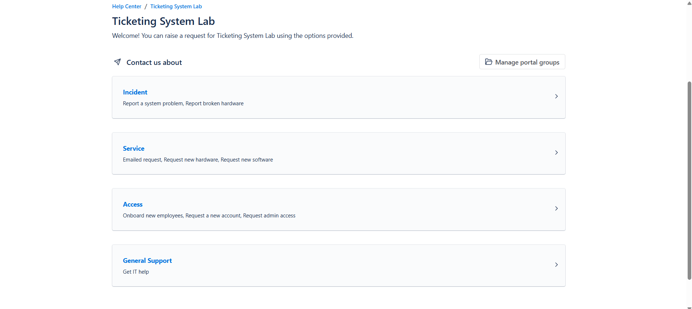

*Figure 2: SLA Config*
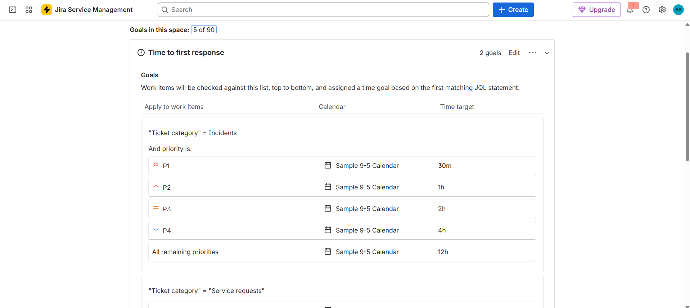

**Key Learnings** 
- Platform Administration & Triage: Gained hands-on experience configuring an enterprise service desk, translating high-volume prioritization skills into structured IT workflows using P1-P4 priority schemes and ordered queues.
- Active Directory Integration: Bridged the gap between ticketing and infrastructure by executing real administrative tasks—such as user provisioning, security group assignments, and password resets—in response to simulated user requests.
- Workflow Automation: Learned how to track and manage response metrics by configuring custom SLA calendars and building automation rules for ticket assignment and threshold warnings.
- Knowledge Management: Demonstrated the value of centralized documentation by writing and linking Confluence KB articles, streamlining the troubleshooting process for internal agents.
- Diagnostic Methodologies: Applied structured troubleshooting steps to diagnose client-to-server connectivity, isolating network faults using standard command-line utilities and documenting the resolutions as reproducible runbooks.

**Next Steps**  
I plan to implement a ServiceNow version of this project to compare popular ITSM implementations. I will also utilize the diagnostic methodologies and troubleshooting practiced in this lab to prepare for the CompTIA A+ certification exams.

**Build Log** 

July 3: ServiceNow 
- Created a ServiceNow account and requested a Private Developer Instance. I'm waiting to get off their waitlist. 
  
July 8: Platform Configuration and SLAs  
- The demand for ServiceNow PDIs are just too high, so I set up a Jira Service Management environment instead.  Created the four primary request categories and established the P1-P4 priority scheme. Defined custom SLA metrics for Time to First Response, Time to Resolution, and Time to Close after resolution. Configured the calendars so the resolution timers strictly tick during standard 9-5 business hours, while the closure timer utilizes a 24/7 schedule.

July 9: Queues, Automation, and Knowledge Base  
- Implemented three dedicated agent views: a priority queue, an SLA queue, and a general view queue. Designed automation rules to handle automatic ticket assignment and trigger SLA threshold warnings. Signed up for Confluence, authored a knowledge base article on troubleshooting network drives, and linked the space directly to JSM.
  
  - **Challenge/Solution:** The Confluence free tier doesn't grant external visibility for linked knowledge base articles. Copied and uploaded the KB article to this repo as a raw text file instead.
 
*Figure 3: SLA Threshold Notification*
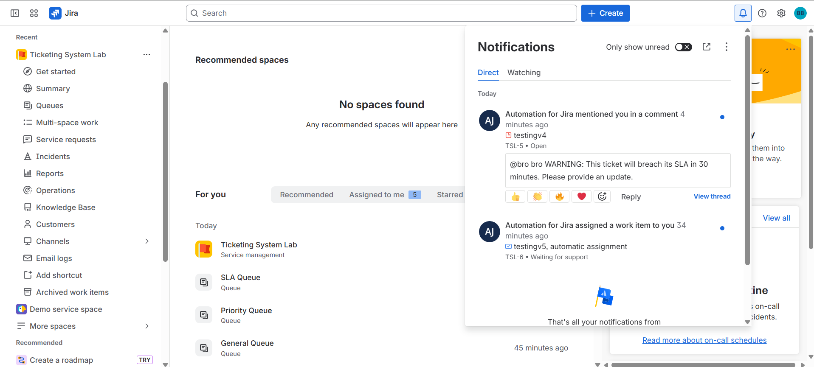
  
*Figure 4: Ticket Queues*
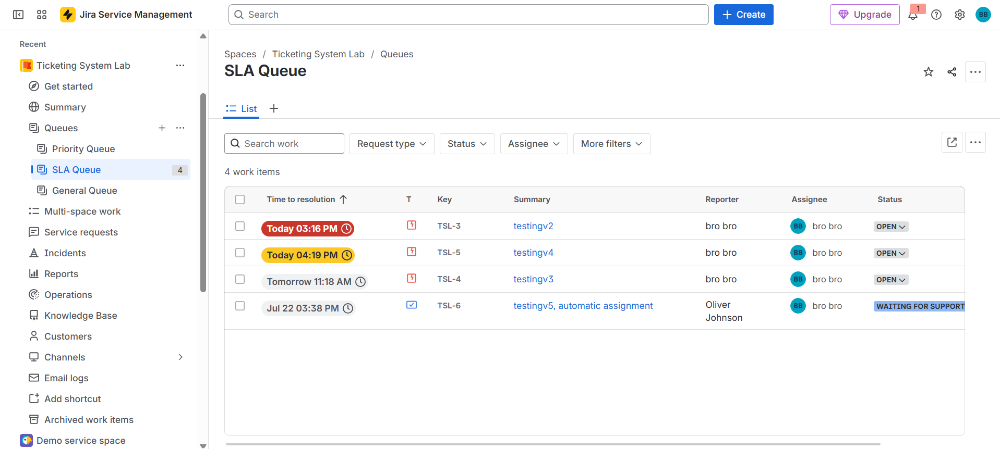

July 10: Active Directory Administration & Helpdesk Ticket Resolution  
- **Ticket 1 - Account Security & Identity Management:** Processed a simulated Priority 2 (P2) account lockout incident. Diagnosed the lockout status within ADUC, cleared the flag, and issued a secure password reset. Practiced clear, professional communication with simualted user via Jira Service Management ticket comments and documented the root cause before closing the request.

*Figure 5: Account Lock Out*
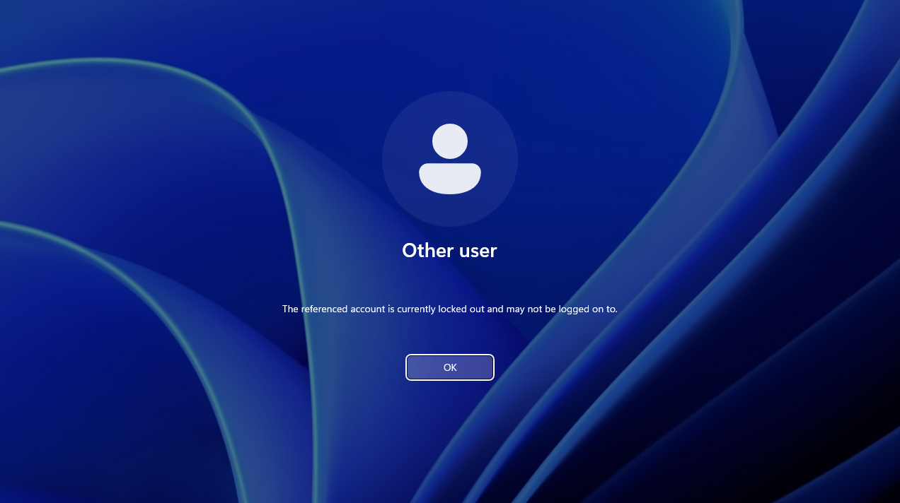

*Figure 6: JSM Ticket*
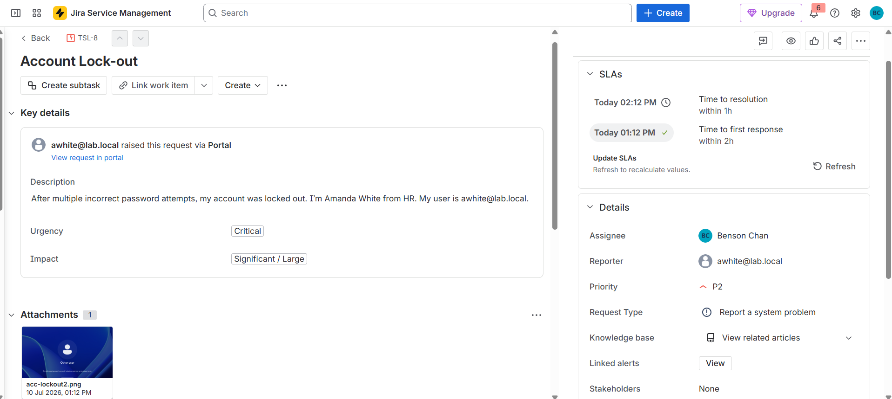

*Figure 7: ADUC Account Unlock and Password Reset*
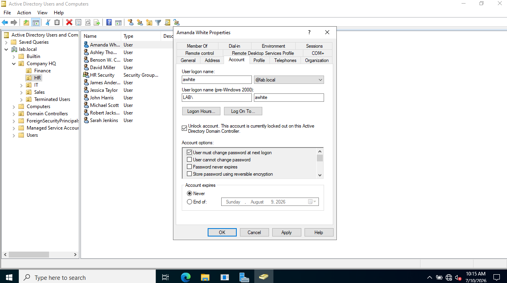

*Figure 8: Successful Log in*
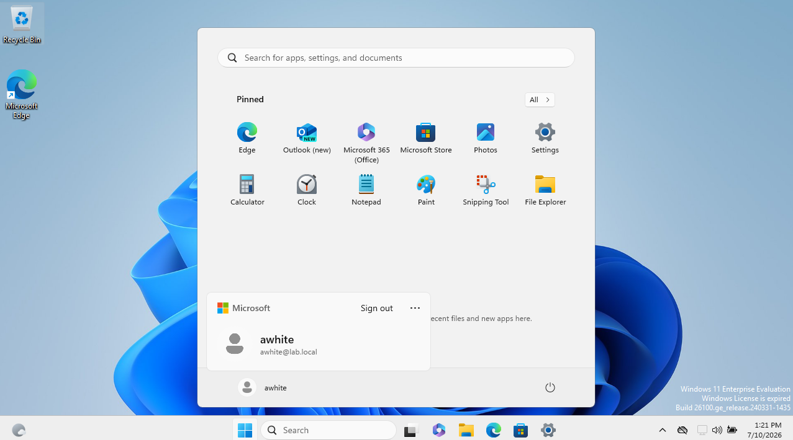

- **Ticket 2 - User Provisioning & Group Policy Management:** Executed an end-to-end onboarding workflow for a new hire. Provisioned the account via Active Directory Users and Computers (ADUC) and enforced an initial password reset upon first logon for security compliance. Assigned the user to the Finance Security Group, ensuring role-based access control and the successful application of departmental Group Policy Objects (GPOs) for secure folder access.

*Figure 9: JSM Ticket*
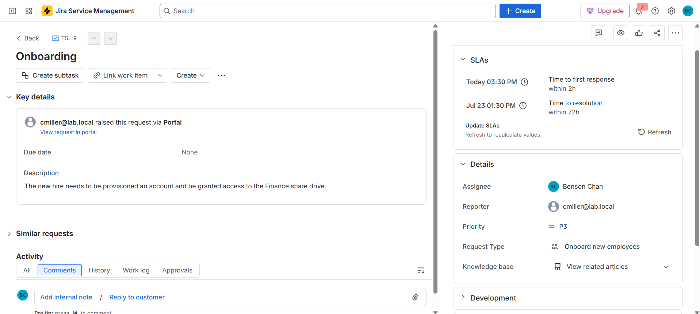

*Figure 10: Account Provisioning*
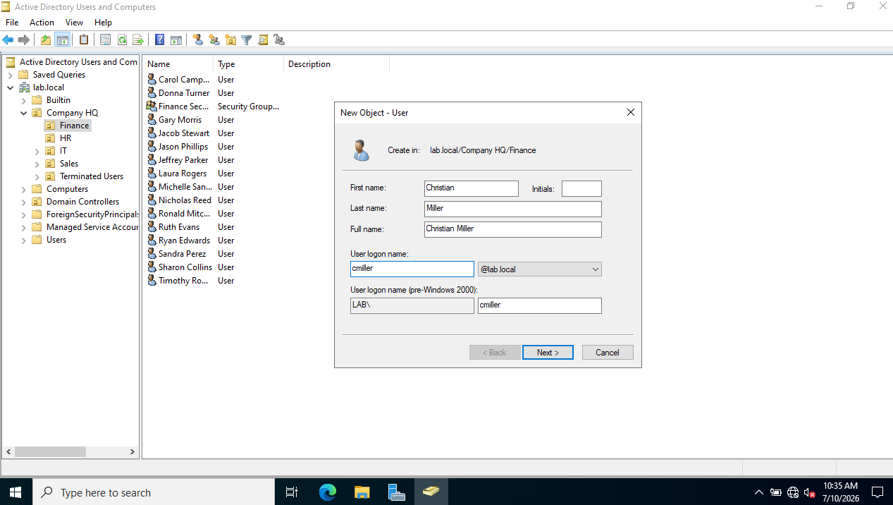

*Figure 11: Security Group Addition*
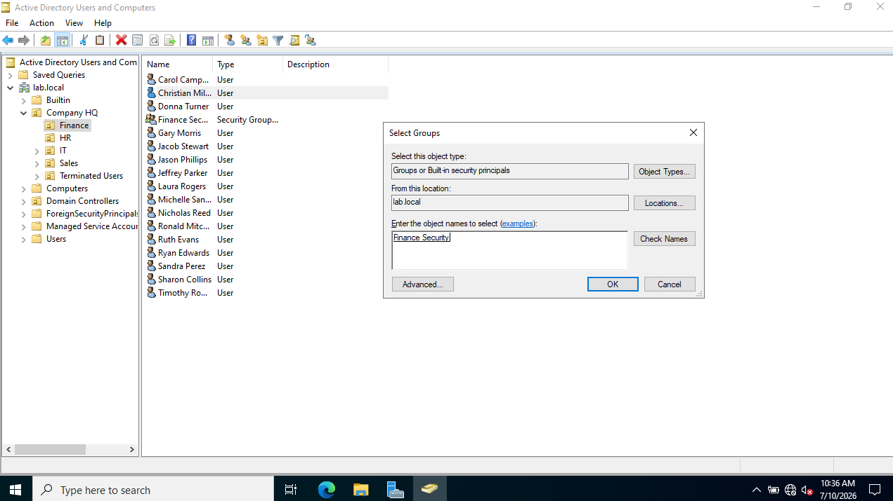

*Figure 12: Initial Log On Success*
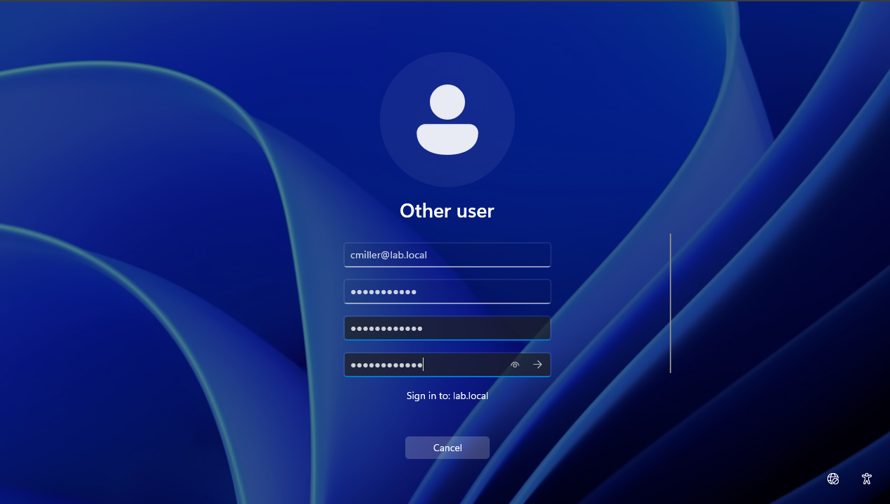

*Figure 13: Department Share Drive Access Granted*
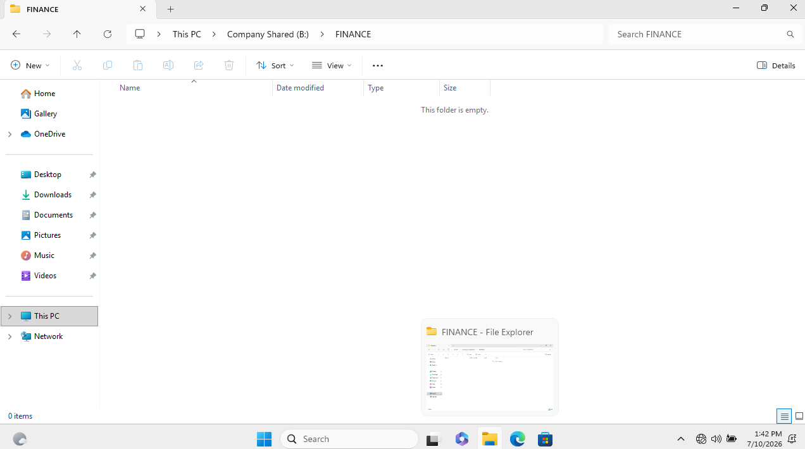

- **Ticket 3 - Network Diagnostics & PowerShell Administration:** Resolved a simulated DNS failure on a client machine. Applied a structured diagnostic methodology, using ping to test local broadcast connectivity and nslookup to definitively isolate the failure to the DNS layer. Bypassed user-level GUI restrictions by deploying an elevated PowerShell command (Set-DnsClientServerAddress -ResetServerAddresses) to restore DHCP configurations and resolve the ticket within the established SLA threshold.
  
  - **Challenge/Solution:** While diagnosing the inaccessible network drive, I used ping on the DC/DNS/DHCP servers and it successfully went through. This was surprising because I had deliebrately broken the DNS connection. After some review, I realized that Windows uses protocols like NetBios to resolve pings through broadcasts. So instead, I used nslookup localhost to isolate the DNS as the issue.
 
*Figure 14: DNS Connection Issue -> Network Drive Access Lost*
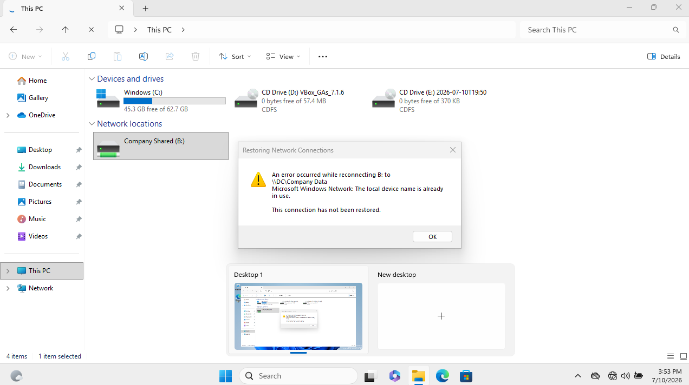

*Figure 15: Ticket View*
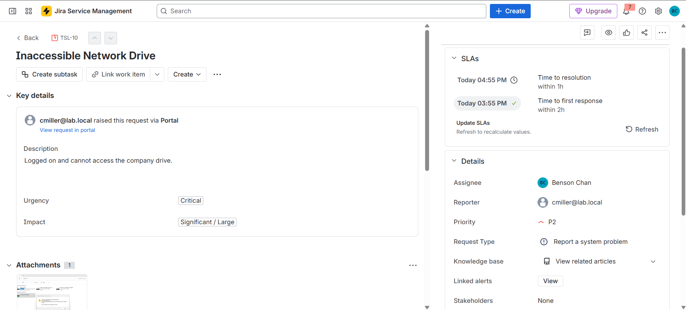

*Figure 16: Diagnostics -> ping, nslookup, ipconfig*
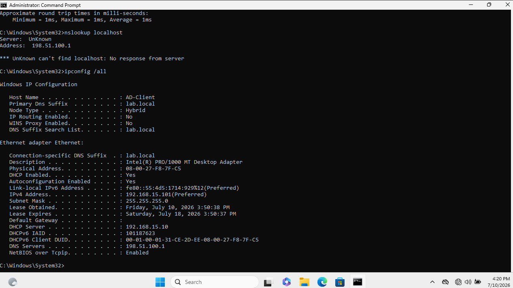

*Figure 17: Solution -> reinstate DNS server + ipconfig /flushdns*
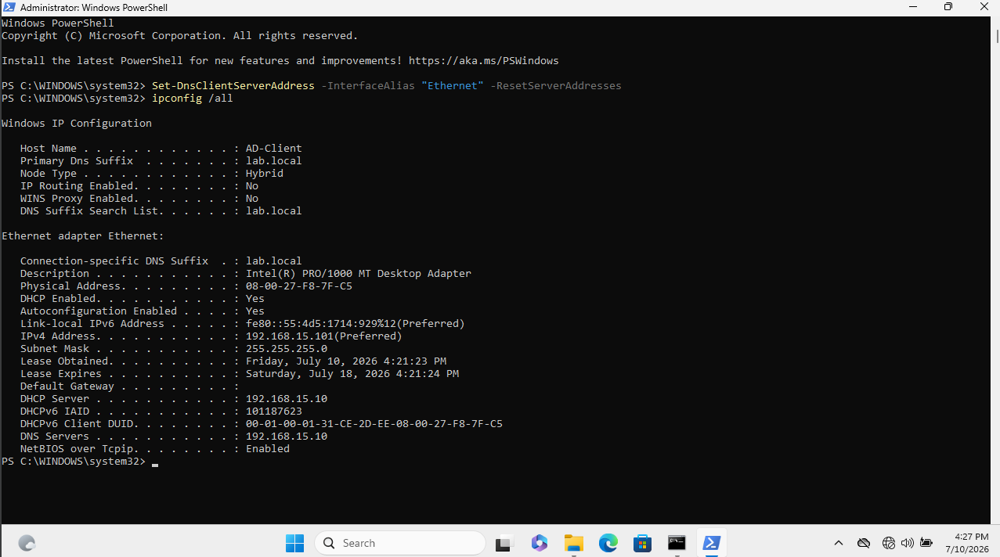

*Figure 18: Network Drive Access Restored*
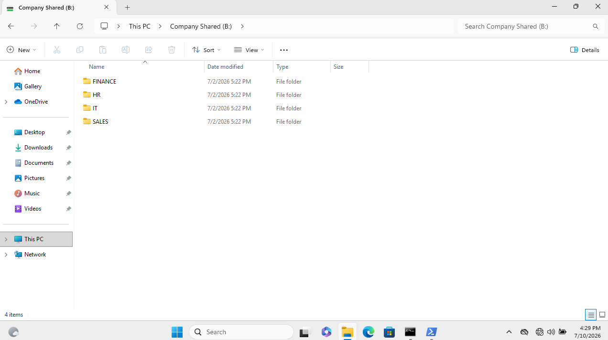

  
